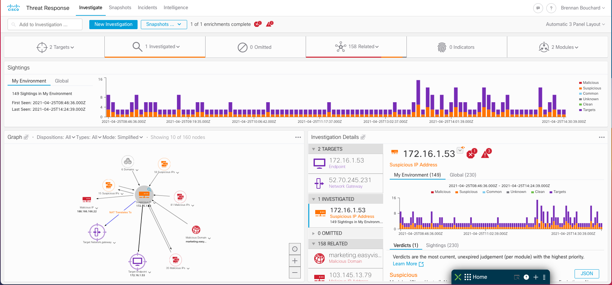
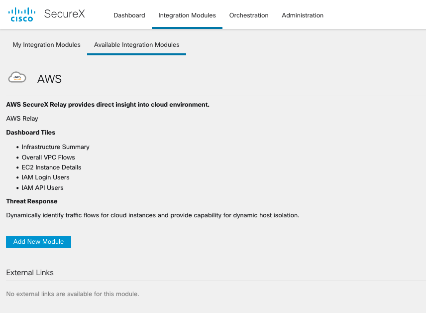
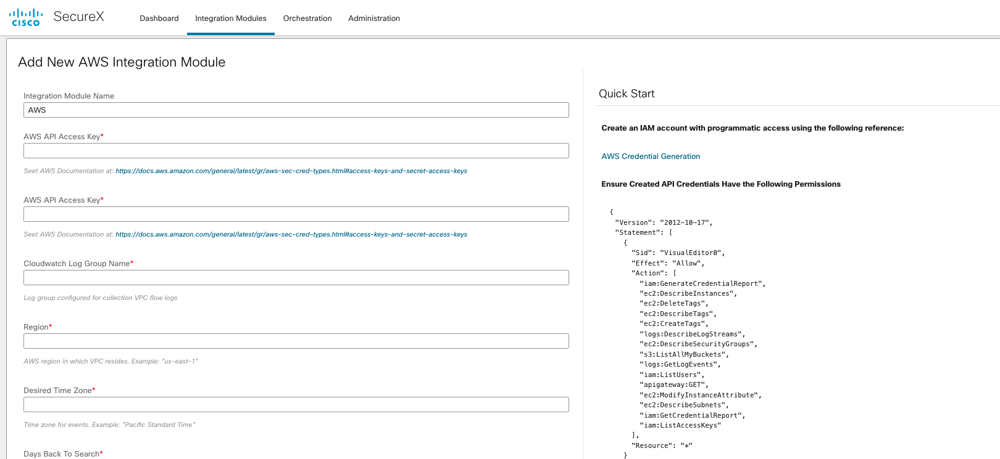
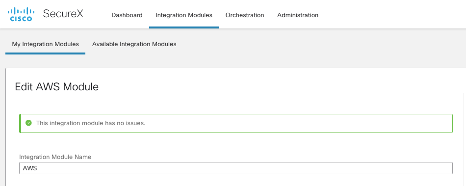

[](https://gitter.im/CiscoSecurity/Threat-Response "Gitter Chat")
[](https://travis-ci.com/CiscoSecurity/tr-05-serverless-relay)

# AWS VPC Flow Relay

SecureX Relay to identify ingress and egress traffic from an AWS VPC
Intelligence service provider.



The Relay itself is just a simple application written in Python that can be
easily packaged and deployed as an AWS Lambda Function using
[Zappa](https://github.com/Miserlou/Zappa).

## Rationale

1. We need an application that will translate API requests from SecureX Threat Response
to the third-party integration, and vice versa. This application is provided
here in the GitHub repository, and we are going to install it in AWS Lambda
using Zappa.

2. AWS Lambda allows us to deploy our application without deploying a dedicated
server or paying for so called "idle" cycles. AWS handles instantiation and
resource provisioning; all we need to do is define the access rights and upload
our application.

3. Zappa is a helper tool that will package our application and publish it to
AWS as a Lambda function. It abstracts a large amount of manual configuration
and requires only a very simple configuration file, which we have provided and
will explain how to customize it during this process.

## Step 0: AWS Setup

To get started, you have to set up your AWS environment first by carefully
following the instructions from the [AWS HOWTO](aws/HOWTO.md). In addition, the
document also covers how to configure the [Zappa Settings](zappa_settings.json)
by explaining the relationships between the values there and your AWS setup.

## Step 1: Create AWS Policy and User

In order for the relay to function the API credentials in AWS must have appropriate
permissions applied. The following is a sample policy configuration to allow for the 
approriate access on all resources for desired operation. This policy could be modified
to restrict access to only a subset of resources as well if desired. 

### In AWS Create IAM policy with the following JSON and asign it to your API user

```json
{
  "Version": "2012-10-17",
  "Statement": [
    {
      "Sid": "VisualEditor0",
      "Effect": "Allow",
      "Action": [
        "iam:GenerateCredentialReport",
        "ec2:DescribeInstances",
        "ec2:DeleteTags",
        "ec2:DescribeTags",
        "ec2:CreateTags",
        "logs:DescribeLogStreams",
        "ec2:DescribeSecurityGroups",
        "s3:ListAllMyBuckets",
        "logs:GetLogEvents",
        "iam:ListUsers",
        "apigateway:GET",
        "ec2:ModifyInstanceAttribute",
        "ec2:DescribeSubnets",
        "iam:GetCredentialReport",
        "iam:ListAccessKeys"
      ],
      "Resource": "*"
    }
  ]
}
```

## Step 2: Requirements Installation

First of all, make sure that you already have Python 3 installed by typing
```
python3 --version
```
in your command-line shell.

The application has been implemented and tested using `Python 3.7`. You may try
to use any higher versions if you wish as they should be backward-compatible.

After that, you have to create a "virtual environment" to isolate the
application-specific requirements from the libraries globally installed to your
system. Here are the steps to follow:

1. Create a virtual environment named `venv`:

   `python3 -m venv venv`

2. Activate the virtual environment:
   - Linux/Mac: `source venv/bin/activate`
   - Windows: `venv\Scripts\activate.bat`

3. Upgrade PIP (optional):

   `pip install --upgrade pip`

**NOTE**. The virtual environment has to be created only once, you just have
to make sure to activate it each time you are working on or playing with the
application (modern IDEs can automatically do that for you). You can deactivate
a previously activated virtual environment by simply typing `deactivate` in
your command-line shell.

Finally, install the libraries required for the application to function from
the [requirements.txt](requirements.txt) file:

```
pip install --upgrade --requirement requirements.txt
```

## Step 3: Application Deployment

### Scripted Deployment

The process for deploying the python module to AWS Lambda and creating the integration module object
in SecureX leverages the included deploy_relay.py script.

#### The required arguments and flags are below

 * Operation: deploy, update, or remove 
 * Region: -r Example "us-east-1"
 * Project Name: -p Example "AWS_Test_Relay"
 * SecureX Region: -x must be US, EU, or APJC
 * AWS API Client ID: -i 
 * AWS API Client Secret: -s 
 * Lambda Memory: -m Optional im MB, defaults to 4096
 * Lambda Timeout: -t Optional in seconds, defaults to 90 seconds

### Deploy Example

deploy_relay.py deploy -r us-east-1 -p AWS_Test_Relay -x US -i client_****** -s secret_****** -m 1024 -t 60

##### Expected Output
<pre>
Encryption Secret Generated
Obtained SecureX Auth Token
Zappa configuration file created

100%|██████████| 637k/637k [00:00<00:00, 15.5MB/s]
100%|██████████| 31.1k/31.1k [00:00<00:00, 5.12MB/s]
100%|██████████| 12.3M/12.3M [00:09<00:00, 1.29MB/s]
100%|██████████| 1.68k/1.68k [00:00<00:00, 8.41kB/s]
75%|███████▌  | 3/4 [00:13<00:04,  4.34s/res]
App Deploy Complete
SecureX Integration Module Created

Process finished with exit code 0
</pre>

### Configure New Integration

From SecureX Available Integration Modules Select AWS 



Add Configuration Details and Click Save



SecureX Will Validate with Health Check, and You are Good To Go


